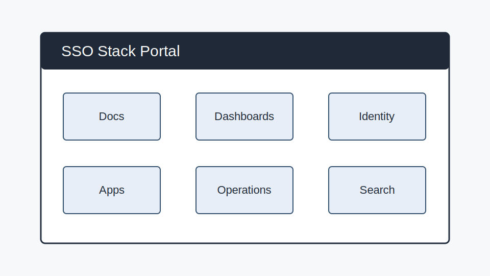
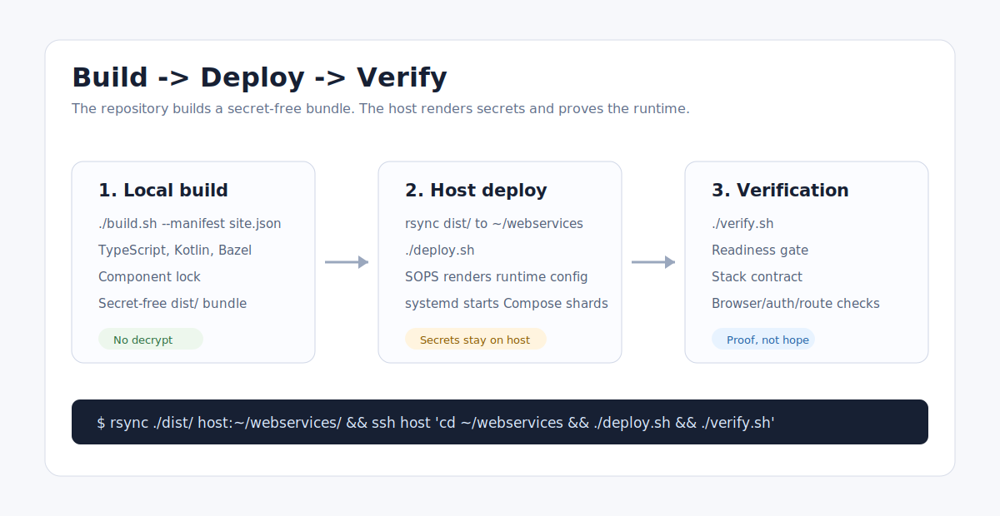
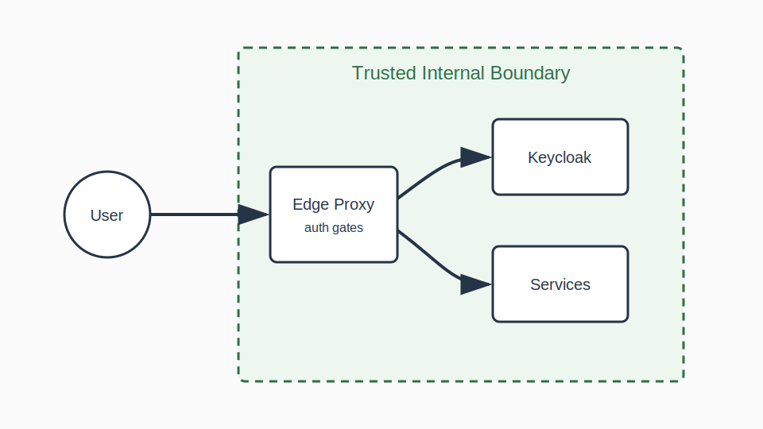
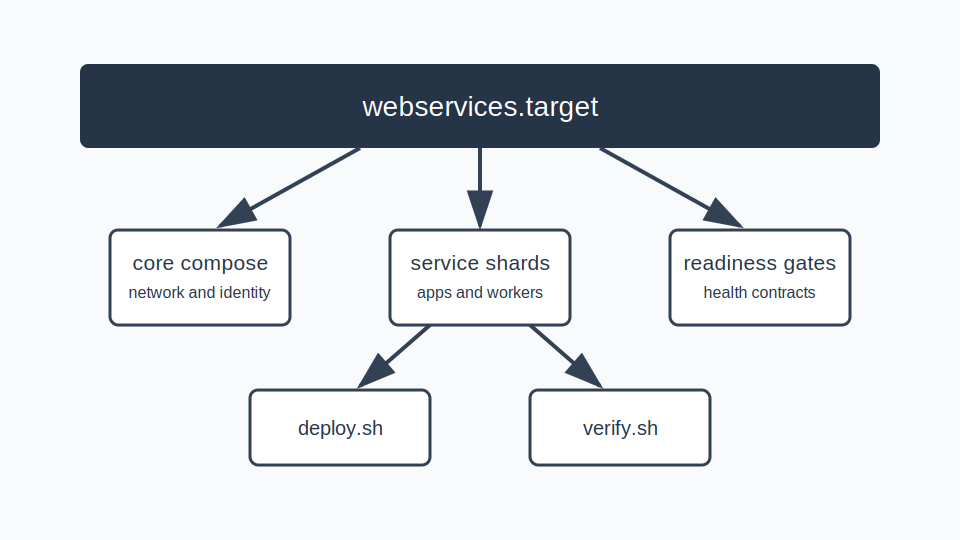
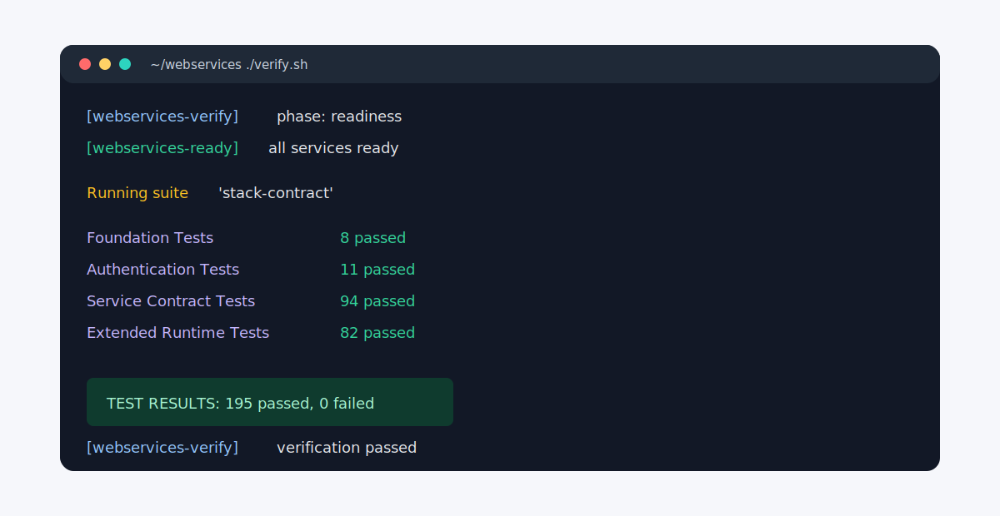

# Web Services

A self-hosted platform stack generator for authenticated internal web services.

This repository does not ship one app. It builds a complete, tested platform:
Caddy at the edge, Keycloak for identity and RBAC, Docker Compose for service
runtime, `systemd --user` for supervision, SOPS-backed site secrets, and a
verification suite that proves the deployed stack works.

## For Buyers

If you are evaluating this as a private open-source infrastructure engagement:

- [Buyer Overview](docs/buyer-overview.md)
- [Packages](docs/packages.md)
- [Host Sizing](docs/host-sizing.md)
- [Service Maturity](docs/service-maturity.md)
- [Threat Model](docs/threat-model.md)
- [Restore Drill](docs/restore-drill.md)
- [Update And Rollback](docs/update-and-rollback.md)
- [Support Boundaries](docs/support-boundaries.md)
- [Client Intake](docs/client-intake.md)

Buyer-facing website: [website/](website/README.md). Open
`website/index.html` locally until a public site URL is published.

## Mission

This project is part of a broader pattern: making small groups powerful without
making them dependent.

See [Mission](docs/mission.md).



## Fast Evaluation

If you are deciding whether this is serious platform engineering or just a
Compose pile, inspect these first:

| Signal | Where to look |
| --- | --- |
| Secret-free local build | [Build System](docs/build-system.md) |
| Centralized identity and RBAC | [Security And Auth](docs/security-and-auth.md) |
| Generated lifecycle graph | [Systemd Graph](docs/systemd-graph.md) |
| Deployed verification suite | [Testing](docs/testing.md) |
| Service integration standard | [Service Standard](docs/service-standard.md) |

For a focused review path, use the
[Engineering Evaluation Guide](docs/evaluation-guide.md).

## Why Engineers Care

Running a dozen useful self-hosted apps is easy. Keeping them coherent is the
hard part: one login model, one routing layer, one observability story, one
deployment contract, and tests that catch auth or routing drift before users do.

This repo turns that operating model into source:

- a site manifest selects components and site inputs
- local build produces a secret-free deploy bundle
- host deploy renders secrets only on the target machine
- generated systemd units supervise Compose shards
- Caddy and Keycloak provide shared access control
- `./verify.sh` proves the deployed runtime before it is trusted

## The Shape Of The Platform



```text
source templates + site manifest
        |
        v
local build and tests
        |
        v
secret-free dist/ bundle
        |
        v
host deploy renders runtime secrets
        |
        v
systemd user units start Compose shards
        |
        v
verification proves the deployed stack
```

The split matters. The local build is inspectable and secret-free. The target
host is the only place where encrypted site inputs are decrypted into runtime
files.

## Trust Boundary



Client-provided identity headers are not trusted. Caddy and Keycloak establish
identity, the auth gateway verifies access, and services receive only the
claims that pass through that edge.

## Runtime Orchestration



The generated systemd graph gives operators a real service surface. Docker
Compose still runs containers, but systemd owns grouping, readiness, restarts,
and partial upgrades.

## What You Get

| Area | Included capabilities |
| --- | --- |
| Edge and identity | Caddy, Keycloak, OIDC clients, forward auth, group-based RBAC |
| App platform | Homepage catalog, service routing, health checks, generated config |
| Collaboration | BookStack, Seafile, SOGo, Element, Planka, Vaultwarden |
| Productivity and media | ERPNext, Donetick, Home Assistant, Jellyfin, Mastodon |
| AI and development | JupyterHub, disposable workspaces, Forgejo, Qdrant, search, knowledge ingestion, ChatGPT Connector |
| Operations | Grafana, Prometheus, Loki, cAdvisor, exporters, Kopia backups |
| Validation | Kotlin contract tests, TypeScript unit tests, Playwright browser checks, SSO/auth boundary tests, visual artifacts |

The concrete catalog is in [docs/services.md](docs/services.md).

## Quick Start

Most operators only need this flow:

```bash
cd sso-stack-generator

SITE_MANIFEST="/path/to/site/manifest.json"
TARGET_HOST="user@example-host"

./build.sh --manifest "$SITE_MANIFEST"

ssh "$TARGET_HOST" 'mkdir -p ~/webservices && test -w ~/webservices'
rsync -av --no-group --delete ./dist/ "$TARGET_HOST":~/webservices/

ssh "$TARGET_HOST" 'cd ~/webservices && ./deploy.sh'
ssh "$TARGET_HOST" 'cd ~/webservices && ./verify.sh'
```

Read [docs/quickstart.md](docs/quickstart.md) when you want the same flow with
operator notes and first-run troubleshooting.

## Verification



The test model is intentionally layered:

- `./build.sh --manifest <manifest.json>` runs source-local checks.
- `./verify.sh` runs readiness and the blocking deployed stack contract.
- `./run-tests.sh all` runs the broader deployed suite when release confidence matters.
- `./run-tests.sh` supports `list`, `plan [target]`, `changed`, `source-unit`,
  `kt-tests [suite]`, `kt-plan [suite]`, and `kt-one <id> [suite]` for
  targeted iteration; `all` runs the exhaustive suite.
- `./scripts/security-audit.sh` runs the lightweight local security drift checks.

See [docs/testing.md](docs/testing.md) for target names, browser requirements,
and artifact locations.

## Knowledgebase

Start with [docs/service-standard.md](docs/service-standard.md) for the service
contract, then [docs/README.md](docs/README.md) for the broader documentation
map.

| Question | Best entry point |
| --- | --- |
| What is this project demonstrating? | [Project Overview](docs/project-overview.md) |
| Is this worth adopting or extending? | [Engineering Evaluation Guide](docs/evaluation-guide.md) |
| How is it put together? | [Architecture](docs/architecture.md) |
| How do I deploy it? | [Quickstart](docs/quickstart.md) |
| How do I operate it after deploy? | [Operations](docs/operations.md) |
| How do I recover from bad states? | [Recovery](docs/recovery.md) |
| How are auth and secrets handled? | [Security And Auth](docs/security-and-auth.md) |
| How do I add a service properly? | [Service Standard](docs/service-standard.md) |
| How do I debug failures? | [Troubleshooting](docs/troubleshooting.md) |

## Repository Map

| Path | Purpose |
| --- | --- |
| `stack.compose/` | Source Docker Compose shards for platform services. |
| `stack.config/` | Config templates, entrypoints, Caddy config, Keycloak config, and app configs. |
| `stack.containers/` | Custom container build contexts. |
| `stack.kotlin/` | Kotlin services and Kotlin test runner code. |
| `stack.systemd/` | Source graph for generated systemd user units. |
| `scripts/` | Build, deploy, render, and validation helpers. |
| `global.settings/` | Shared non-secret defaults and generated-bundle settings. |
| `ops/host-admin/` | Destructive host-admin tooling such as purge scripts. |
| `docs/` | Human documentation and GitHub-safe screenshots. |
| `dist/`, `out/`, `build/` | Generated outputs. Do not edit as source. |

## What This Repo Does Not Own

- plaintext site secrets
- production-specific private values
- downstream-only customizations
- generated output treated as source
- one-off host mutations outside the deploy contract

Site-specific inputs live outside this repo and are selected explicitly with a
manifest path.

## Safety Rules

- Edit source, not generated output.
- Keep secrets encrypted until host deploy.
- Do not add repo-root `.env` files.
- Do not commit `dist/`, `out/`, Gradle outputs, Bazel outputs, or rendered runtime material.
- Keep destructive host operations under `ops/host-admin/`.
- Prefer targeted tests during development and `verify.sh` before trusting a deployment.
